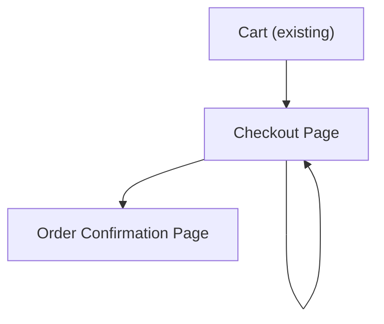

## 1. Product Overview
A responsive checkout experience with a multi-column layout that combines a validated form with an always-visible order summary and primary action.
It should reuse the existing design tokens and class naming conventions.

## 2. Core Features

### 2.1 Feature Module
1. **Checkout Page**: multi-column layout, order summary, checkout form, sticky primary action, validation styling, responsive collapse.
2. **Order Confirmation Page**: confirmation message, key order details, next-step navigation.

### 2.3 Page Details
| Page Name | Module Name | Feature description |
|-----------|-------------|---------------------|
| Checkout Page | Page layout | Render desktop-first two-column layout: form (primary) + order summary (secondary); collapse into single-column on smaller screens while preserving order summary access. |
| Checkout Page | Order summary | Show line items, quantities, subtotal, shipping/tax (if available), and total; reflect updates from form selections if applicable. |
| Checkout Page | Checkout form | Collect required customer inputs (e.g., contact + address + payment fields as applicable) with clear required/optional labels. |
| Checkout Page | Validation & errors | Validate on blur and on submit; show field-level error states and messages; show form-level error summary when submit fails. |
| Checkout Page | Sticky primary action | Keep the primary “Place order / Pay now” action visible via sticky placement (desktop within column; mobile via sticky bottom bar); disable while submitting. |
| Checkout Page | Responsive behavior | Collapse columns at defined breakpoints; ensure CTA and total remain visible; prevent sticky overlap with safe areas and footers. |
| Checkout Page | Accessibility | Provide proper labels, help text, keyboard navigation, focus states, and ARIA for errors and status updates. |
| Order Confirmation Page | Confirmation content | Confirm successful checkout; show essential order identifiers and totals; provide a clear next step (continue shopping / view order). |

## 3. Core Process
- Shopper Flow:
  1. Enter Checkout from an existing cart or product flow.
  2. Review order summary while completing the checkout form.
  3. Submit using the sticky primary action.
  4. If validation fails, see inline errors and correct fields.
  5. On success, navigate to Order Confirmation.

