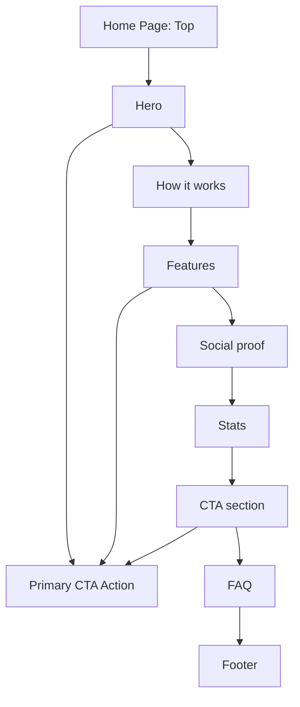

## 1. Product Overview

Redesign the Home page to look modern and premium, improve conversion to the primary CTA, and meet high accessibility and performance standards.
This redesign clarifies value, builds trust (proof + stats), and reduces friction from first view to action.

## 2. Core Features

### 2.1 Feature Module

Our Home page redesign consists of the following main pages:

1. **Home page**: header/navigation, hero, how-it-works, features, social proof, stats, CTA, FAQ, footer, accessibility + performance compliance.

### 2.3 Page Details

| Page Name | Module Name                | Feature description                                                                                                                                                         |
| --------- | -------------------------- | --------------------------------------------------------------------------------------------------------------------------------------------------------------------------- |
| Home page | Header & Navigation        | Provide persistent top navigation with clear primary CTA; support in-page anchors to sections; include skip-to-content link.                                                |
| Home page | Hero (Value + CTA)         | Communicate core value proposition; show supporting subcopy; display primary CTA and secondary CTA; include relevant premium visual; ensure above-the-fold clarity.         |
| Home page | How it works               | Explain the journey in 3–5 steps; keep copy scannable; include small supporting icons/illustrations.                                                                        |
| Home page | Features                   | Highlight key differentiators in a card grid; allow quick scanning; include short benefit-led titles and descriptions.                                                      |
| Home page | Social proof               | Build trust with testimonial cards and/or logos; show name/source when available; keep proof readable and accessible.                                                       |
| Home page | Stats                      | Show 3–6 measurable metrics (e.g., customers served, satisfaction, repeat rate) with short captions; avoid misleading claims.                                               |
| Home page | Conversion CTA section     | Reinforce value with concise copy; provide strong primary CTA; include reassurance microcopy (e.g., shipping/returns/guarantee) if applicable.                              |
| Home page | FAQ                        | Answer top objections in an accordion; support keyboard navigation; include links to deeper help pages if they already exist.                                               |
| Home page | Footer                     | Provide essential links, contact and legal items, and social links; repeat primary CTA; ensure strong contrast and focus states.                                            |
| Home page | Accessibility requirements | Meet WCAG 2.2 AA: semantic landmarks, keyboard-only usability, visible focus, sufficient contrast, reduced-motion support, descriptive alt text, and accessible accordions. |
| Home page | Performance requirements   | Meet Core Web Vitals and UX budgets: optimize images, reduce JS, limit layout shift, and ensure fast interactivity.                                                         |

## 3. Core Process

**Primary visitor flow (conversion-focused):**

1. You land on the Home page and immediately understand the value proposition in the hero.
2. You choose a primary CTA or scroll to learn “How it works.”
3. You scan features, proof, and stats to validate trust.
4. You expand FAQs to resolve objections.
5. You convert via the primary CTA (from hero, sticky CTA, or CTA section).

**Accessibility flow (keyboard + assistive tech):**

1. You use “Skip to content” to bypass navigation.
2. You navigate section anchors and controls (buttons, FAQ accordion) via keyboard.
3. You complete CTA actions with clear labels, focus indicators, and predictable behavior.

