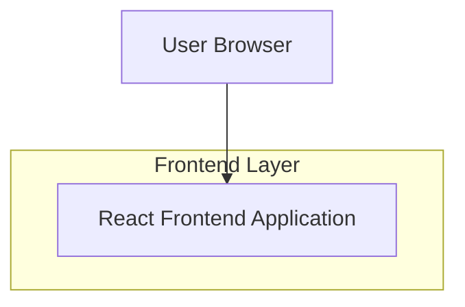

## 1.Architecture design

## 2.Technology Description
- Frontend: React@18 (existing app) + existing CSS system (design tokens + established class naming)
- Backend: None (page-only implementation)

## 3.Route definitions
| Route | Purpose |
|-------|---------|
| /checkout | Checkout page with multi-column layout, validated form, order summary, sticky primary action |
| /checkout/success | Order confirmation page (post-submit landing) |

## 6.Data model(if applicable)
No new persistent data model is required