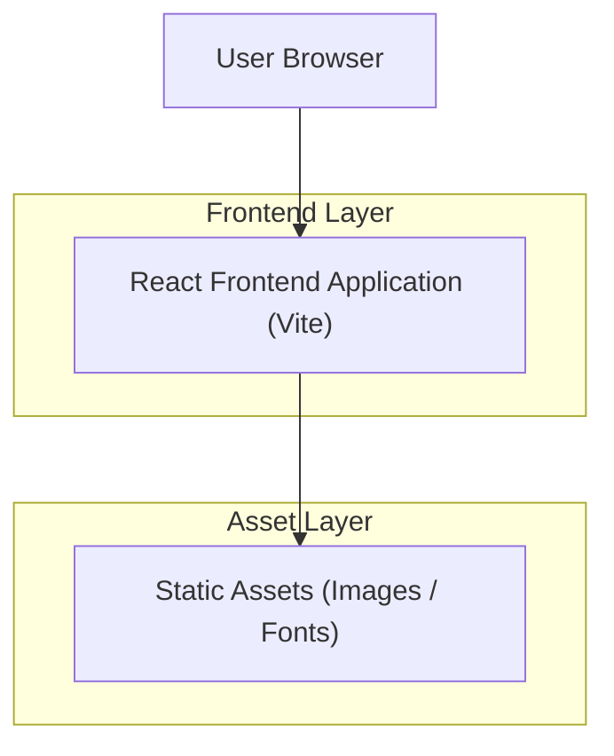

## 1.Architecture design

## 2.Technology Description
- Frontend: React@18 + TypeScript + vite + CSS (project styling system) + existing UI/motion components
- Backend: None (Home page redesign is frontend-only)

## 3.Route definitions
| Route | Purpose |
|-------|---------|
| / | Home page with redesigned sections and conversion CTA |
| /shop | Product browsing and purchase entry point (linked from header/footer) |
| /new-arrivals | New arrivals discovery page (linked from header/footer) |
| /scent-voyage | Editorial/experience page (linked from navigation) |
| /contact | Contact page (linked from footer/FAQ) |

## 4.Performance & quality budgets (implementation targets)
- Core Web Vitals targets: LCP ≤ 2.5s, INP ≤ 200ms, CLS ≤ 0.1 (p75 on representative devices).
- Lighthouse targets (mobile): Performance ≥ 90, Accessibility ≥ 95, Best Practices ≥ 95, SEO ≥ 90.
- Asset discipline: responsive images (srcset), lazy-load below-the-fold media, avoid large autoplay video, preconnect only when needed.
- JS budget: keep Home page critical-path JS minimal; defer non-critical animations and below-the-fold widgets.
- CSS strategy: prefer reusable components and avoid layout thrash; ensure font loading avoids FOIT (use swap) and prevents CLS.
- Accessibility regression protection: automated checks in CI (e.g., axe) and keyboard testing for hero CTAs and FAQ accordion.
