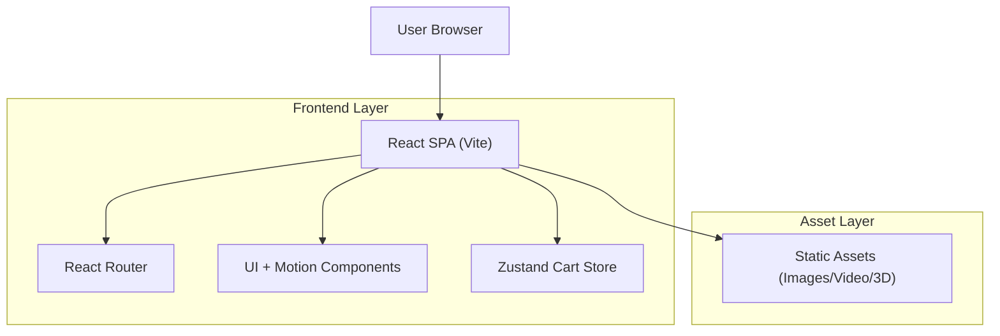

## 1.Architecture design

## 2.Technology Description
- Frontend: React@19 + react-router-dom@7 + vite
- Styling: tailwindcss@4 + clsx + tailwind-merge
- Motion: framer-motion@12
- State: zustand@5 (cart drawer + cart count)
- SEO (recommended for upgrade): react-helmet-async (route-level meta)
- Optional immersion dependencies (only if needed):
  - 3D: three + @react-three/fiber (fallback-first)
  - Video: native `<video>` + MP4/H.264 + WebM; no autoplay audio

## 3.Route definitions
| Route | Purpose |
|-------|---------|
| / | Home page (immersive hero + sections) |
| /shop | Shop all products (grid + filters + sorting) |
| /category/:slug | Shop view scoped by category slug |
| /collections/new | New arrivals landing |
| /new | Alias to new arrivals |
| /collections/specials | Sale/specials landing |
| /sale | Alias to sale/specials |
| /collections/scent-diffusers | Diffusers landing |
| /diffusers | Alias to diffusers |
| /collections/fragrance-oils | Oils landing |
| /oils | Alias to oils |
| /collections/fragrance-room-sprays | Room sprays landing |
| /sprays | Alias to sprays |
| /collections/candles | Candles category page |
| /candles | Alias to candles |
| /collections/perfumes | Perfumes category page |
| /perfumes | Alias to perfumes |
| /collection/voyage | Scent Voyage page |
| /collections/scent-voyage | Alias to Scent Voyage |
| /pages/scent-voyage | Alias to Scent Voyage |
| /contact | Contact page |
| * | Fallback to Home |

Performance & SEO implementation notes (frontend-only):
- Route-based code splitting (`React.lazy`) for heavy pages (Scent Voyage) and 3D/video modules.
- Performance budgets (enforced in review): keep LCP asset small; lazy-load non-critical media; avoid layout shift by reserving aspect-ratio boxes.
- SEO: unique per-route `<title>`/`<meta>` via Helmet; ensure content is present in DOM (avoid text in canvases only).
